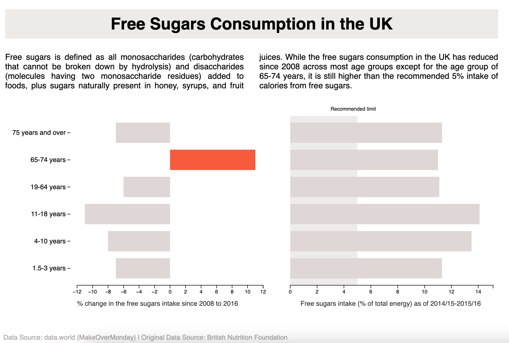

# Sugar Consumption in the UK (2008-2016) | Data Visualization: d3.js v7

## Chart type: Bar

<!-- Description/ -->
Bar charts that show % of change in the free sugars intake since 2008 to 2016 and free sugars intake as of 2014/15 - 2015/16 for different age groups.

## Visualization

<!-- Description/ -->
In this chart, I'm plotting the %change in the free sugar consumption since 2008 until 2016 for each age group, and the % of total energy from free sugar consumption in 2015-16 for each age group along with the recommended limit

## Data

<!-- Description/ -->
Original data file - data.csv

- Columns - All age groups by gender, Paired years
- Column values -  (**string**) each age group for each gender, (**float**) % of total energy in the form of free sugars for all age groups and each gender 

Cleaned and edited data file - AgeGroup.csv

- Columns - Age Group, Each pair of year from 2008 to 2016
- Column values - (**string**) Each Age Group, (**float**) % of total energy in the form of free sugars intake for every age group for each pair of year

## Data Cleaning - Python

<!-- Description/ -->
Here, I'm plotting values just for each age group. So, I extracted rows with terms - 'Children' and 'Adults' in them, and renamed the columns for brevity. 

## Data Manipulation - Javascript

<!-- Description/ -->
I have two plots here so, I created data objects for the same in the js file -
1. For showing the % change in the free sugar intake from 2008 till 2016
2. For showing the % of total energy in the form of free sugar for 2015-16 period (latest year in the data)

